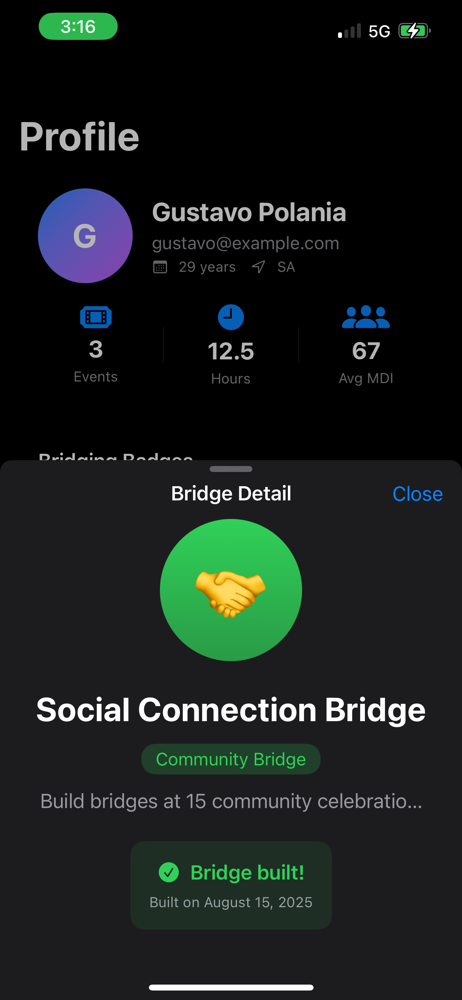
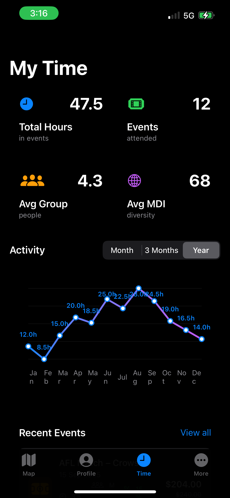
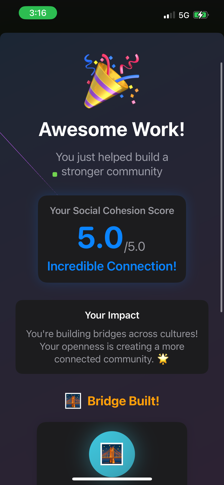
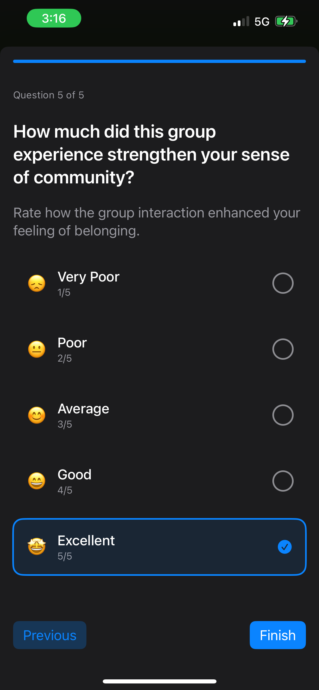
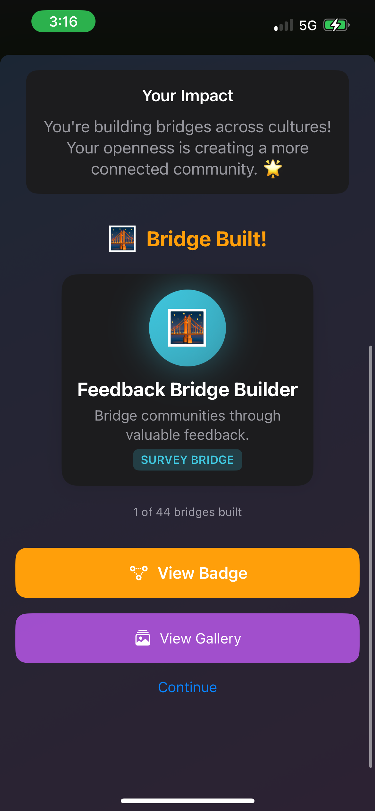

# MateHub 🤝

*Building bridges across cultures through shared experiences*

## The Problem & Our Solution

Australia's multicultural communities often struggle to connect meaningfully across cultural boundaries. Traditional networking events lack incentives for genuine intercultural exchange, and people tend to stay within their comfort zones.

**MateHub** (formerly Cohesion Pass) is an iOS app that gamifies cultural diversity at community events. By offering tangible discounts and rewards based on a user's Multicultural Diversity Index (MDI), we incentivize authentic cross-cultural connections and break down social barriers.

### 📊 Dataset Attributions

- **Core Dataset
	- Scanlon Institute – Mapping Social Cohesion 2024
	- Link: https://scanloninstitute.org.au/mapping-social-cohesion-2024
	- Usage: Provides the baseline for social cohesion in Australia, including belonging, trust, discrimination, and attitudes to diversity.
	- Integration: Data is extracted from report tables and transformed into CSV for analysis in MateHub. Serves as the foundation for the Cohesion Index.
	- Attribution: Mapping Social Cohesion 2024 data © Scanlon Institute.

- **Demographic Dataset
	- Australian Bureau of Statistics – Permanent Migrants in Australia, 2021
	- Link: https://www.abs.gov.au/statistics/people/people-and-communities/permanent-migrants-australia/2021
	- Usage: Provides demographic context for MateHub, including age, gender, country of birth, and employment status of migrants. Used to simulate diverse user profiles and validate the Diversity Index (IDM) logic.
	- Attribution: Data sourced from the Australian Bureau of Statistics, Permanent Migrants in Australia, 2021.

- **Taxonomy Dataset
	- SAcommunity – Thesaurus
	- Link: https://sacommunity.org/thesaurus/
	- Usage: Provides a taxonomy of community services and categories, helping classify events consistently (sports, culture, GLAM, civic, etc.) within the app.
	- Attribution: Event categorisation supported by SAcommunity Thesaurus.

## 🗂️ App Gallery

### Main Interface
| Profile & Achievements | Time Tracking Dashboard |
|----------------------|------------------------|
|  |  |

### Bridge Building & Surveys  
| Achievement Unlocked | Survey Interface |
|---------------------|------------------|
|  |  |

### Gamification & Impact
| Impact Feedback | Bridge Details |
|----------------|----------------|
|  | *Coming Soon* |

## 🎯 Key Features

### 🗺️ Interactive Event Map
- Full-screen map displaying community events with custom pins
- **MINGLE Pricing**: Original prices crossed out, discounted prices prominently displayed
- Random discount percentages (15%, 20%, 25%) based on user's diversity engagement
- Real-time event discovery with location-based filtering

### 👤 Comprehensive Profile System  
- **100+ Achievement Badges**: From "Social Connection Bridge" to specialized cultural engagement trophies
- Personal diversity statistics and MDI scoring
- Event attendance tracking with hours logged
- Profile customization with personal photos

### 🎤 Post-Event Voice Surveys
- Simulated voice-to-text transcription with typewriter animation effect
- 5-question cultural impact assessment
- Audio feedback collection for event organizers
- Smart text handling with unlimited scroll for long responses

### ⏱️ Time & Impact Tracking
- "My Time" dashboard showing total hours in cultural events
- Average group size and diversity metrics
- Monthly/quarterly activity graphs
- Recent events timeline with participation history

### 🏆 Gamification System
- Bridge-building metaphors for cultural connections
- Social Cohesion Score (0-5.0 scale)
- Achievement unlocking based on diverse participation
- Impact messaging: "You're building bridges across cultures!"

## 🛠️ Technical Architecture

### Stack
- **Framework**: SwiftUI with iOS 15+ deployment target
- **Database**: SQLite with custom schema for events, users, and achievements
- **Location**: MapKit integration with custom pin annotations
- **Speech**: AVFoundation with Speech Recognition (simulator fallbacks)
- **Images**: AsyncImage with bundle resource loading
- **Architecture**: MVVM pattern with ObservableObject ViewModels

### Key Components
- `EnhancedMapView`: Full-screen map with custom pricing pins
- `VoiceAIRegistrationView`: Speech-to-text survey interface  
- `ProfileView`: Badge gallery and user statistics
- `TimeTrackingView`: Activity dashboard with charts
- `EventListView`: Curated event discovery
- 
## 📱 Installation & Setup

### Prerequisites
- iOS 15.0+ / Xcode 13+
- CocoaPods or Swift Package Manager
- Device with location services capability

### Run Instructions
1. Clone the repository:
   ```bash
   git clone https://github.com/GapolaniaDev/MateHub.git
   cd MateHub
   ```

2. Open in Xcode:
   ```bash
   open LatunGovHack.xcodeproj
   ```

3. Configure permissions in `Info.plist`:
   ```xml
   <key>NSLocationWhenInUseUsageDescription</key>
   <string>MateHub needs location access to show nearby cultural events</string>
   <key>NSMicrophoneUsageDescription</key>
   <string>Voice surveys help improve cultural event experiences</string>
   <key>NSSpeechRecognitionUsageDescription</key>
   <string>Speech recognition enables hands-free survey responses</string>
   ```

4. Build and run on simulator or device
   - **Note**: Voice features require physical device; simulator shows placeholder UI

### Database Seeding
The app includes a pre-populated database with:
- 50+ diverse community events across major Australian cities
- 100+ achievement badges with cultural themes
- Sample user profiles with varied cultural backgrounds
- Historical event data for testing time tracking features

## Multicultural Diversity Index (MDI)

The MDI is MateHub's core algorithm that quantifies a user's cross-cultural engagement:

### Calculation Formula
```swift
MDI = (Cultural_Backgrounds × 0.3) + 
      (Cross_Cultural_Events × 0.4) + 
      (Community_Bridges_Built × 0.3)
```

### Discount Scale
- **MDI 0.0-2.0**: 15% discount on events
- **MDI 2.1-3.5**: 20% discount on events  
- **MDI 3.6-5.0**: 25% discount on events

### Bridge Building Metrics
- **Community Bridge**: Attend events with 3+ different cultural groups
- **Language Bridge**: Participate in multilingual events
- **Generational Bridge**: Mixed-age group participation
- **Faith Bridge**: Interfaith community events
- **Geographic Bridge**: Events across different suburbs/regions

### Cultural Background Classifications
Based on Australian Standard Classification of Cultural and Ethnic Groups (ASCCEG) 2019:
- 40+ cultural background categories
- Regional groupings for Oceania, Asia, Europe, Americas, Africa, Middle East
- Indigenous Australian cultural recognition protocols

## 🔒 Privacy & Ethics

### Data Collection
- **Location**: Only when actively using map features
- **Voice**: Processed locally, never stored on servers
- **Cultural Identity**: User-declared, never assumed or auto-detected
- **Participation**: Always opt-in for diversity tracking

### Ethical AI Considerations
- No algorithmic bias in cultural categorization
- User agency in cultural identity representation
- Transparent MDI scoring methodology
- Right to data deletion and score reset

### Cultural Sensitivity
- Collaborated with multicultural community organizations
- Regular bias auditing of event recommendations
- Indigenous cultural protocols respected in all features
- No stereotyping or cultural assumptions in UI/UX


*Gallery showcases real user interfaces demonstrating cultural bridge-building achievements and community impact tracking*

## 🚀 Future Roadmap

### Version 2.0 Features
- **Social Connections**: Friend networks and group challenges
- **Event Creation**: User-generated multicultural events
- **AI Recommendations**: Personalized cultural discovery engine
- **Integration**: Partnership with local councils and cultural organizations

### Long-term Vision
- **Cross-platform**: Android version with feature parity 
- **Enterprise**: Corporate diversity training and team building tools
- **Research**: Academic partnerships for social cohesion studies

## 🤝 Contributing

We welcome contributions that enhance cultural connectivity and community building:

1. Fork the repository
2. Create a feature branch (`git checkout -b feature/cultural-enhancement`)
3. Commit changes (`git commit -am 'Add meaningful cultural feature'`)
4. Push to branch (`git push origin feature/cultural-enhancement`)
5. Create Pull Request

### Contribution Guidelines
- Respect cultural sensitivities in all code and content
- Test on diverse user personas and cultural contexts
- Follow SwiftUI and iOS accessibility best practices
- Include unit tests for cultural algorithm changes

## 📄 License

This project is licensed under the MIT License - see the [LICENSE](LICENSE) file for details.

## 🙏 Acknowledgments

- Australian multicultural community organizations for guidance and feedback
- GovHack 2025 for providing the platform to address social cohesion challenges
- Cultural diversity researchers and social scientists for algorithmic insights
- Beta testing communities across Melbourne, Sydney, and Brisbane

---

**MateHub** - *Connecting cultures, building community, one bridge at a time* 🌏

[GitHub](https://github.com/GapolaniaDev/MateHub) | [Contact](mailto:gustav0796@hotmail.com)
